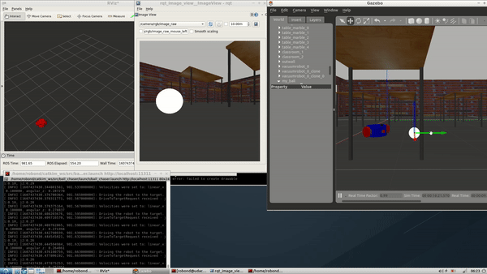
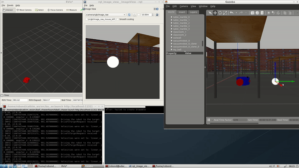

[](https://www.udacity.com/robotics)

# Go Chase It
 Project 2 of the Udacity Robotics Software Engineer Nanodegree. A robot who can chase a ball.

## Description

In this project, I create two ROS packages inside my `catkin_ws/src`: the `drive_bot` and the `ball_chaser`. Here are the steps to design the robot, house it inside my world, and program it to chase white-colored balls:

#### 1. drive_bot:

  * I created a my_robot ROS package to hold my robot, the white ball, and the world.
  * I Designed a drive robot with the Unified Robot Description Format. Added two sensors to my robot: a lidar and a camera. Added Gazebo plugins for my robot’s drive, lidar, and camera. 
  * Housed my robot inside the world I built.
  * Added a white-colored ball to my Gazebo world and saved a new copy of this world.
  * The `world.launch` file launched my world with the white-colored ball and my robot.
  
#### 2.ball_chaser:

  * I created a ball_chaser ROS package to hold your C++ nodes.
  * I wrote a `drive_bot` C++ node that will provide a `ball_chaser/command_robot` service to drive the robot by controlling its linear x and angular z velocities. The service will publish to the wheel joints and return back the requested velocities.
  * I wrote a process_image C++ node that reads my robot’s camera image, analyzes it to determine the presence and position of a white ball. If a white ball exists in the image, my node will request a service via a client to drive the robot towards it.
  * The `ball_chaser.launch` run both the drive_bot and the process_image nodes.


### Behaviour

1. Ball is seen by camera
   In this case, the robot will drive towards the ball, turning left of right based on the position of the ball in the image.When the robot is close enough to the ball, it will stop approaching.

  <p align="center">
    
  </p>

  <p align="center">
    
  </p>

## Instructions

1. Clone the repository

```git
$ git clone https://github.com/tinachientw/RoboND-GoChaseIt.git $PATH_TO_PARENT_DIR/catkin_ws
```

2. Initialise catkin workspace and set env variables

```shell
$ cd $PATH_TO_PARENT_DIR/catkin_ws/
$ catkin_make
$ source devel/setup.bash
```
where $SHELL can be "sh", "bash" or "zsh" and $VERSION can be "pre_melodic" or "melodic".

3. Launch the world
```shell
$ roslaunch my_robot world.launch
```
4. Launch ball_chaser nodes in a new terminal
```shell
$ cd $PATH_TO_PARENT_DIR/catkin_ws/
$ source devel/setup.bash
$ roslaunch ball_chaser ball_chaser.launch
```
5. Run rqt_image_view in a new terminal to see what the camera sees
```shell
$ cd $PATH_TO_PARENT_DIR/catkin_ws/
$ source devel/setup.bash
$ rosrun rqt_image_view rqt_image_view
```
You can also use the RViz window that is already launched together with the gazebo simulation.

6. Drop the ball
The ball is initially hidden from the robot, move it where it can find it. 

## License
Original version of the license of this repository can be found here:
https://gist.github.com/laramartin/7796d730bba8cf689f628d9b011e91d8